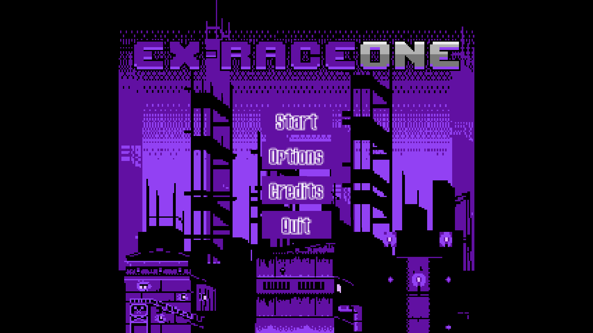
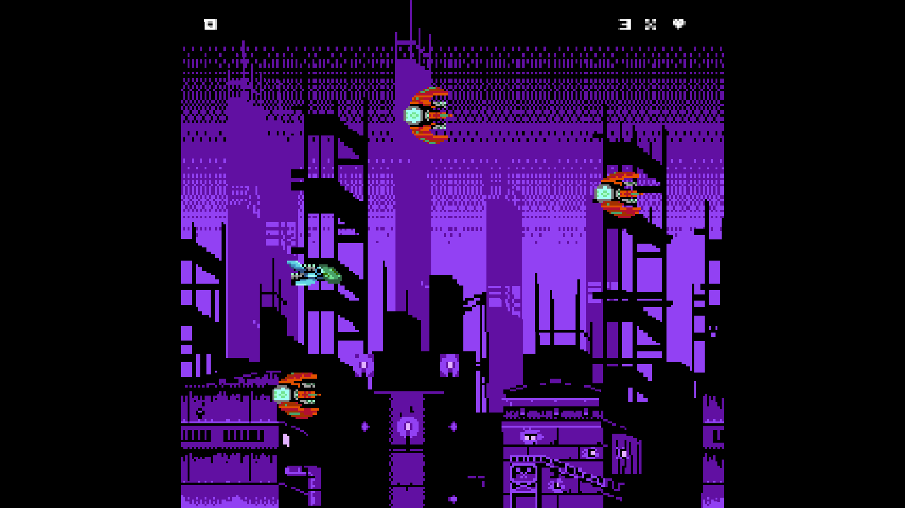

# ex-raceone

ex-raceone is a retro endless space shooter game made with pygame, drawing inspiration from classic arcade titles. Both web and Windows versions are available.
Survive the onslaught of enemies while protecting your ship and aiming to stay alive. Earn points by destroying enemy ships.

## How to play

**[Arrow Keys]** - Move Ship

**[Space]** - Shoot Lasers

## How to Download

Simply download the zip file and extract it to your desired location. Then run the `ex-raceone.exe` and dive into the action! Enjoy! Please feel free to let me know what you think! I truly appreciate any feedback.

## Credits

[ansimuz](https://ansimuz.itch.io/) - Graphics

[Juhani Junkala](https://opengameart.org/users/subspaceaudio) - Musics & Sounds

## Look & feel

- NES-style 8-bit graphics
- Fullscreen support for widescreen displays
- Native resolution is 256x240
- Compatible with both web and desktop platforms

## Build

- Windows (PyInstaller)
- Web (Pygbag)

## Guides & Advises for pygame development

### Avoid Repeats

Eliminate repetitive code by creating classes or functions.

### Use Inheritance

Implement inheritance where applicable, such as Sprite -> Player, State -> Level.

### Resolution

Implement a scaling system to increase the native resolution of the game on display, including support for fullscreen mode.

### Layers

Organize game elements into layers:

- Background
- Obstacles
- Player
- UI

### Game Controller

The controller is the core of the program, initiating the main game loop.
It manages game states (menu, level, ending) and facilitates state transitions.

### State System

Utilize a state class to manage game and entity states.
Entities interact with a state group for logic execution.
Organize your game with game states.

### Constants File

Store static variables such as window information and game state names in a constants file.

### Event Handler

Handle user input.
Implement a command design pattern for encapsulating button inputs.

### Animation System

Implement an animation function for dynamic entities.
